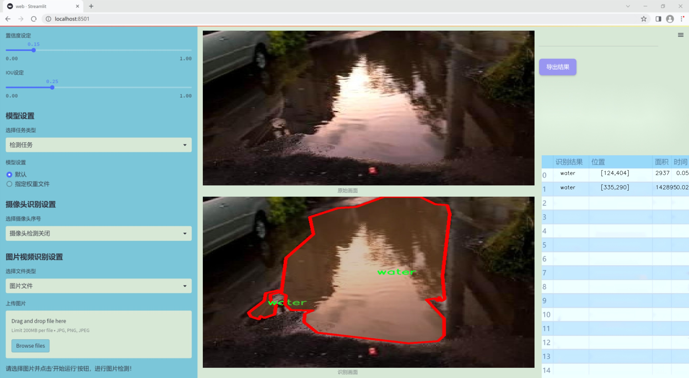
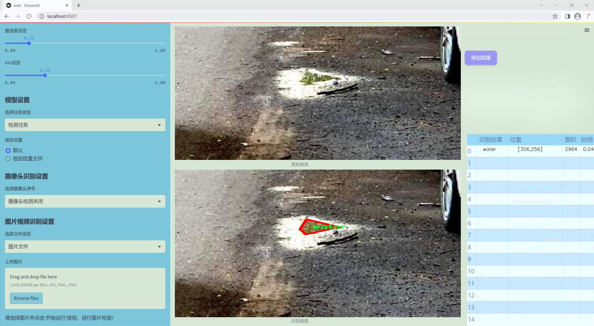
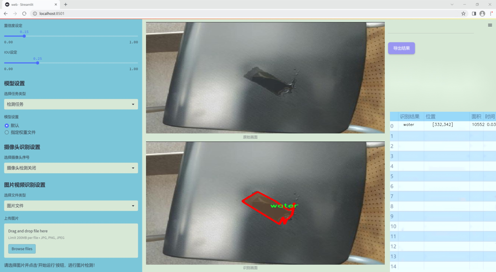
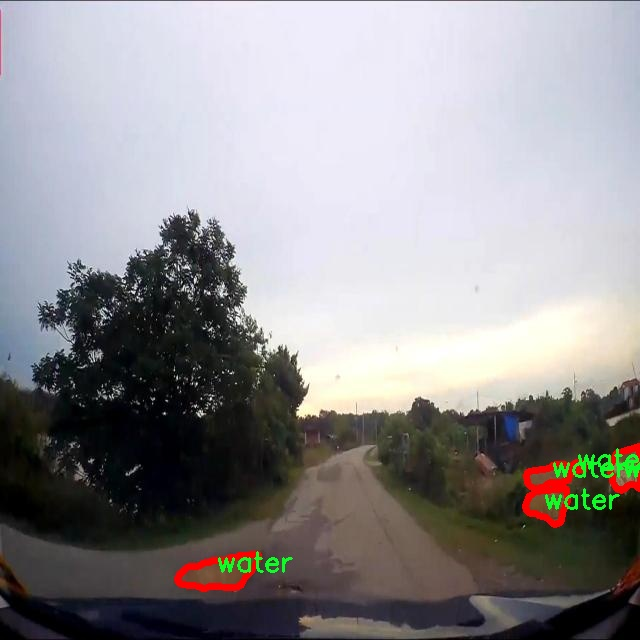
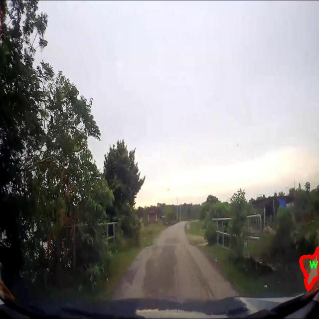
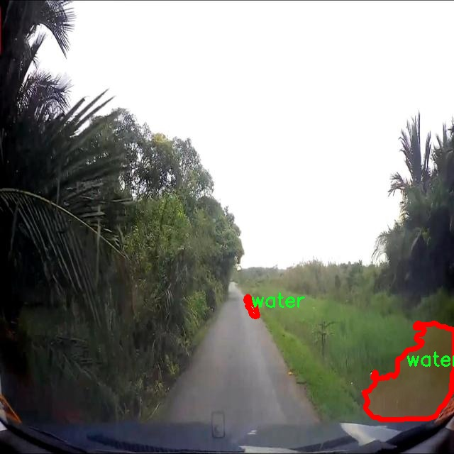
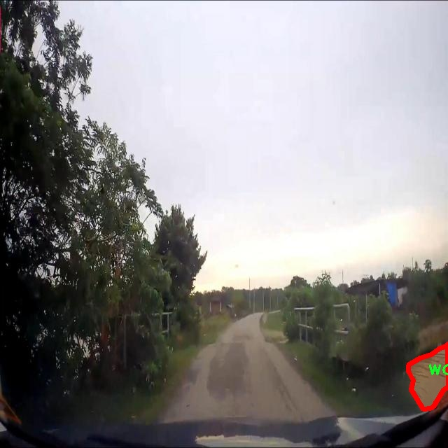
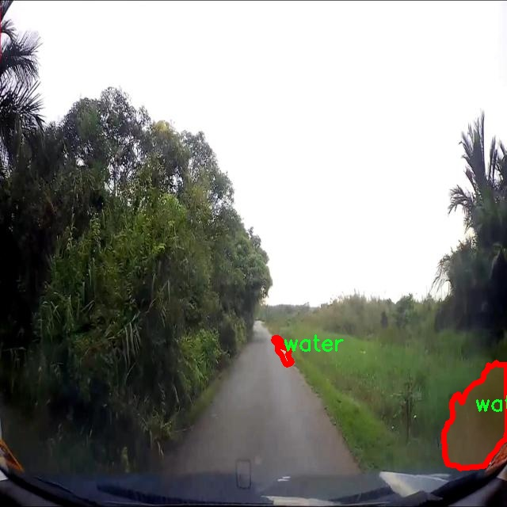

### 1.背景意义

研究背景与意义

随着城市化进程的加快，水洼的产生不仅影响了城市的美观，还可能对行人和车辆的安全造成威胁。因此，及时、准确地检测水洼成为了城市管理和交通安全的重要任务。传统的水洼检测方法往往依赖于人工巡查，效率低下且容易受到主观因素的影响。近年来，计算机视觉技术的快速发展为水洼检测提供了新的解决方案。基于深度学习的目标检测算法，尤其是YOLO（You Only Look Once）系列模型，以其高效的实时检测能力，逐渐成为各类物体检测任务的首选。

本研究旨在基于改进的YOLOv11模型，构建一个高效的水洼检测系统。我们使用的水洼检测数据集包含2400张经过精确标注的图像，专注于水这一类别。通过对这些图像的深度学习训练，模型能够在不同环境下快速识别和定位水洼。这不仅可以提高水洼检测的准确性，还能为城市管理者提供实时数据支持，帮助他们更好地进行城市规划和维护。

在技术层面，YOLOv11模型的改进版本将引入更先进的特征提取和数据处理技术，以提高模型在复杂环境下的鲁棒性和准确性。此外，研究还将探讨如何通过数据增强和迁移学习等方法，进一步提升模型的性能。这些创新不仅具有重要的学术价值，也为实际应用提供了可行的解决方案。

综上所述，基于改进YOLOv11的水洼检测系统的研究，不仅能够推动计算机视觉技术在城市管理中的应用，还将为相关领域的研究提供新的思路和方法，具有重要的理论意义和实际应用价值。

### 2.视频效果

[2.1 视频效果](https://www.bilibili.com/video/BV1KzCFYbE2V/)

### 3.图片效果







##### [项目涉及的源码数据来源链接](https://kdocs.cn/l/cszuIiCKVNis)**

注意：本项目提供训练的数据集和训练教程,由于版本持续更新,暂不提供权重文件（best.pt）,请按照6.训练教程进行训练后实现上图演示的效果。

### 4.数据集信息

##### 4.1 本项目数据集类别数＆类别名

nc: 1
names: ['water']


该项目为【图像分割】数据集，请在【训练教程和Web端加载模型教程（第三步）】这一步的时候按照【图像分割】部分的教程来训练

##### 4.2 本项目数据集信息介绍

本项目数据集信息介绍

本项目旨在改进YOLOv11模型以实现高效的水洼检测系统，因此我们构建了一个专门针对“water_spill_detection”主题的数据集。该数据集的设计充分考虑了水洼的多样性和复杂性，旨在为模型提供丰富的训练样本，以提高其在实际应用中的准确性和鲁棒性。数据集中包含的类别数量为1，具体类别为“water”，这意味着所有样本均围绕水洼这一特定目标展开。 

在数据收集过程中，我们从多个环境中获取了大量水洼的图像，包括城市街道、停车场、室内场所等不同场景。这些图像涵盖了不同的光照条件、天气状况和水洼的形态特征，确保了数据集的多样性和代表性。此外，为了增强模型的泛化能力，我们还对图像进行了多种数据增强处理，如旋转、缩放、裁剪和颜色调整等，以模拟不同的观察角度和环境变化。

每张图像都经过精确标注，确保水洼区域的准确定位。这些标注信息将为YOLOv11模型的训练提供必要的监督信号，使其能够有效学习水洼的特征并在推理阶段进行准确检测。通过使用这一数据集，我们期望能够显著提升水洼检测系统的性能，进而为城市管理、环境监测等领域提供可靠的技术支持。总之，本项目的数据集不仅是模型训练的基础，也是实现高效水洼检测的关键所在。











### 5.全套项目环境部署视频教程（零基础手把手教学）

[5.1 所需软件PyCharm和Anaconda安装教程（第一步）](https://www.bilibili.com/video/BV1BoC1YCEKi/?spm_id_from=333.999.0.0&vd_source=bc9aec86d164b67a7004b996143742dc)


[5.2 安装Python虚拟环境创建和依赖库安装视频教程（第二步）](https://www.bilibili.com/video/BV1ZoC1YCEBw?spm_id_from=333.788.videopod.sections&vd_source=bc9aec86d164b67a7004b996143742dc)

### 6.改进YOLOv11训练教程和Web_UI前端加载模型教程（零基础手把手教学）

[6.1 改进YOLOv11训练教程和Web_UI前端加载模型教程（第三步）](https://www.bilibili.com/video/BV1BoC1YCEhR?spm_id_from=333.788.videopod.sections&vd_source=bc9aec86d164b67a7004b996143742dc)


按照上面的训练视频教程链接加载项目提供的数据集，运行train.py即可开始训练



     Epoch   gpu_mem       box       obj       cls    labels  img_size
     1/200     20.8G   0.01576   0.01955  0.007536        22      1280: 100%|██████████| 849/849 [14:42<00:00,  1.04s/it]
               Class     Images     Labels          P          R     mAP@.5 mAP@.5:.95: 100%|██████████| 213/213 [01:14<00:00,  2.87it/s]
                 all       3395      17314      0.994      0.957      0.0957      0.0843

     Epoch   gpu_mem       box       obj       cls    labels  img_size
     2/200     20.8G   0.01578   0.01923  0.007006        22      1280: 100%|██████████| 849/849 [14:44<00:00,  1.04s/it]
               Class     Images     Labels          P          R     mAP@.5 mAP@.5:.95: 100%|██████████| 213/213 [01:12<00:00,  2.95it/s]
                 all       3395      17314      0.996      0.956      0.0957      0.0845

     Epoch   gpu_mem       box       obj       cls    labels  img_size
     3/200     20.8G   0.01561    0.0191  0.006895        27      1280: 100%|██████████| 849/849 [10:56<00:00,  1.29it/s]
               Class     Images     Labels          P          R     mAP@.5 mAP@.5:.95: 100%|███████   | 187/213 [00:52<00:00,  4.04it/s]
                 all       3395      17314      0.996      0.957      0.0957      0.0845


###### [项目数据集下载链接](https://kdocs.cn/l/cszuIiCKVNis)

### 7.原始YOLOv11算法讲解


YOLO11 是 Ultralytics YOLO 系列的最新版本，结合了尖端的准确性、速度和效率，用于目标检测、分割、分类、定向边界框和姿态估计。与
YOLOv8 相比，它具有更少的参数和更好的结果，不难预见，YOLO11 在边缘设备上更高效、更快，将频繁出现在计算机视觉领域的最先进技术（SOTA）中。


**主要特点**

  * **增强的特征提取：**YOLO11 使用改进的主干和颈部架构来增强特征提取，以实现更精确的目标检测和复杂任务的性能。

  * **针对效率和速度优化：**精细的架构设计和优化的训练流程在保持准确性和性能之间最佳平衡的同时，提供更快的处理速度。

  * **更少的参数，更高的准确度：**YOLO11m 在 COCO 数据集上实现了比 YOLOv8m 更高的 mAP，参数减少了 22%，提高了计算效率，同时不牺牲准确度。

  * **跨环境的适应性：**YOLO11 可以无缝部署在边缘设备、云平台和配备 NVIDIA GPU 的系统上，确保最大的灵活性。

  * **支持广泛的任务范围：**YOLO11 支持各种计算机视觉任务，如目标检测、实例分割、图像分类、姿态估计和定向目标检测（OBB）。


### 8.200+种全套改进YOLOV11创新点原理讲解

#### 8.1 200+种全套改进YOLOV11创新点原理讲解大全

由于篇幅限制，每个创新点的具体原理讲解就不全部展开，具体见下列网址中的改进模块对应项目的技术原理博客网址【Blog】（创新点均为模块化搭建，原理适配YOLOv5~YOLOv11等各种版本）

[改进模块技术原理博客【Blog】网址链接](https://gitee.com/qunmasj/good)


#### 8.2 精选部分改进YOLOV11创新点原理讲解

###### 这里节选部分改进创新点展开原理讲解(完整的改进原理见上图和[改进模块技术原理博客链接](https://gitee.com/qunmasj/good)【如果此小节的图加载失败可以通过CSDN或者Github搜索该博客的标题访问原始博客，原始博客图片显示正常】

### ParC融合位置感知循环卷积简介
ParC：Position aware circular convolution


#### Position aware circular convolution
针对于全局信息的提取作者提出了Position aware circular convolution（也称作Global Circular Convolution）。图中左右实际是对于该操作水平竖直两方向的对称，理解时只看左边即可。对于维度为C*H*W的输入，作者先将维度为C*B*1的Position Embedding通过双线性插值函数F调整到适合input的维度C*H*1（以适应不同特征大小输入），并且将PE水平复制扩展到C*H*W维度与输入特征相加。这里作者将PE直接设置成为了可学习的参数。

接下来参考该博客将加入PE的特征图竖直方向堆叠，并且同样以插值的方式得到了适应输入维度的C*H*1大小的卷积核，进行卷积操作。对于这一步卷积，作者将之称为循环卷积，并给出了一个卷积示意图。


但个人感觉实际上这个示意图只是为了说明为什么叫循环卷积，对于具体的计算细节还是根据公式理解更好。


进一步，作者给出了这一步的伪代码来便于读者对这一卷积的理解：y=F.conv2D（torch.cat（xp，xp，dim=2），kV），实际上就是将xp堆叠之后使用了一个“条形（或柱形）”卷积核进行简单的卷积操作。（但这样会导致多一次重复卷积，因此在堆叠示意图中只取了前2*H-1行）

可以看到在示意图中特征维度变化如下：C*(2H-1)*W ---C*H*1--->C*H*W，作者特意带上了通道数，并且并没有出现通道数的改变，那么这里所进行的卷积应该是depth wise卷积，通过对文章后续以及论文源码的阅读可以得知这一步进行的就是DW卷积。（we introduce group convolution and point wise convolution into these modules, which decreases number of parameters without hurting performance.）


由groups = channel可知使用的是DW卷积
通过上面就完成了一次竖直方向的全局信息交流，同样只要在水平方向进行同样的操作即可做到水平方向的全局信息交流。

#### ParC block

通过ParC成功解决了全局信息提取的问题，接下来就是针对2）3）两点进行改进。首先是Meta-Former模块，Meta-Former由Token Mixer和Channel Mixer构成，ParC首先满足了Token Mixer的全局信息提取的要求，并且相较于Attention在计算成本上更低。


这里①中的PWC即point wise conv，进一步验证了我们前面对于深度可分离卷积的想法，而GCC-H/V即是前面所说的ParC-H/V。

①构建了Meta-Former中的Token mixer模块，那么最后剩下的问题就是3），替换掉Attention模块之后模型不再data driven。为了解决这一点作者给出了一个channel wise attention，先将特征图（x,C*H*W）进行global average（a,C*1*1）并输入一个MLP生成一个channel wise的权重（w,C*1*1），再将权重与特征图在通道方向相乘得到输出（output = wx,C*H*W）。

#### ParC net
对于ParC net 的搭建，作者直接基于MobileViT，采用了分叉结构（c）完成了网络的搭建。


具体而言作者保留了MobileViT中浅层具有局部感受野的MobileNetV2结构，而将网络深层的ViT block替换成了ParC block，使网络变成了一个pure ConvNet。


### 9.系统功能展示

图9.1.系统支持检测结果表格显示

  图9.2.系统支持置信度和IOU阈值手动调节

  图9.3.系统支持自定义加载权重文件best.pt(需要你通过步骤5中训练获得)

  图9.4.系统支持摄像头实时识别

  图9.5.系统支持图片识别

  图9.6.系统支持视频识别

  图9.7.系统支持识别结果文件自动保存

  图9.8.系统支持Excel导出检测结果数据


### 10. YOLOv11核心改进源码讲解

#### 10.1 CTrans.py

以下是对给定代码的核心部分进行提炼和详细注释的结果。代码主要实现了一个通道变换器（Channel Transformer），用于处理图像数据。以下是简化后的代码和注释：

```python
# -*- coding: utf-8 -*-
import torch
import torch.nn as nn
import numpy as np
from torch.nn import Dropout, LayerNorm

class Channel_Embeddings(nn.Module):
    """构建图像的通道嵌入，包括位置嵌入和补丁嵌入。"""
    def __init__(self, patchsize, img_size, in_channels):
        super().__init__()
        # 计算补丁数量
        n_patches = (img_size[0] // patchsize) * (img_size[1] // patchsize)
        # 定义补丁嵌入层
        self.patch_embeddings = nn.Conv2d(in_channels, in_channels, kernel_size=patchsize, stride=patchsize)
        # 定义位置嵌入参数
        self.position_embeddings = nn.Parameter(torch.zeros(1, n_patches, in_channels))
        self.dropout = Dropout(0.1)

    def forward(self, x):
        """前向传播，计算嵌入。"""
        if x is None:
            return None
        # 通过补丁嵌入层处理输入
        x = self.patch_embeddings(x)  # (B, hidden, n_patches^(1/2), n_patches^(1/2))
        x = x.flatten(2).transpose(-1, -2)  # (B, n_patches, hidden)
        embeddings = x + self.position_embeddings  # 加上位置嵌入
        return self.dropout(embeddings)  # 返回经过dropout的嵌入

class Attention(nn.Module):
    """多头注意力机制。"""
    def __init__(self, channel_num):
        super(Attention, self).__init__()
        self.num_attention_heads = 4
        self.query = nn.Linear(channel_num, channel_num, bias=False)
        self.key = nn.Linear(channel_num, channel_num, bias=False)
        self.value = nn.Linear(channel_num, channel_num, bias=False)
        self.softmax = nn.Softmax(dim=-1)

    def forward(self, emb):
        """前向传播，计算注意力输出。"""
        Q = self.query(emb)  # 查询
        K = self.key(emb)     # 键
        V = self.value(emb)   # 值
        attention_scores = torch.matmul(Q, K.transpose(-1, -2)) / np.sqrt(Q.size(-1))  # 计算注意力分数
        attention_probs = self.softmax(attention_scores)  # 计算注意力概率
        return torch.matmul(attention_probs, V)  # 返回加权值

class Block_ViT(nn.Module):
    """ViT模块，包括注意力和前馈网络。"""
    def __init__(self, channel_num):
        super(Block_ViT, self).__init__()
        self.attn = Attention(channel_num)
        self.ffn = nn.Sequential(
            nn.Linear(channel_num, channel_num * 4),
            nn.GELU(),
            nn.Linear(channel_num * 4, channel_num)
        )
        self.norm1 = LayerNorm(channel_num)
        self.norm2 = LayerNorm(channel_num)

    def forward(self, emb):
        """前向传播，经过注意力和前馈网络。"""
        attn_output = self.attn(self.norm1(emb))  # 经过注意力层
        emb = emb + attn_output  # 残差连接
        ffn_output = self.ffn(self.norm2(emb))  # 经过前馈网络
        return emb + ffn_output  # 残差连接

class ChannelTransformer(nn.Module):
    """通道变换器，整合多个嵌入和编码器。"""
    def __init__(self, channel_num=[64, 128, 256, 512], img_size=640):
        super().__init__()
        self.embeddings = Channel_Embeddings(patchsize=40, img_size=(img_size // 8, img_size // 8), in_channels=channel_num[0])
        self.encoder = Block_ViT(channel_num[0])  # 只使用第一个通道的编码器

    def forward(self, en):
        """前向传播，计算输出。"""
        emb = self.embeddings(en)  # 计算嵌入
        return self.encoder(emb)  # 经过编码器

class GetIndexOutput(nn.Module):
    """获取特定索引的输出。"""
    def __init__(self, index):
        super().__init__()
        self.index = index
    
    def forward(self, x):
        """返回指定索引的输出。"""
        return x[self.index]
```

### 代码说明：
1. **Channel_Embeddings**：负责将输入图像分割成补丁并生成嵌入，包括位置嵌入。
2. **Attention**：实现了多头注意力机制，计算输入的注意力分数并返回加权值。
3. **Block_ViT**：包含一个注意力层和一个前馈网络，使用层归一化和残差连接。
4. **ChannelTransformer**：整合嵌入和编码器，处理输入数据并返回经过编码的输出。
5. **GetIndexOutput**：用于提取特定索引的输出。

这些核心部分构成了一个基本的通道变换器架构，适用于图像处理任务。

这个文件定义了一个名为 `CTrans.py` 的深度学习模型，主要用于图像处理，尤其是图像的特征提取和重建。模型的核心是一个通道变换器（Channel Transformer），它通过多层嵌套的神经网络模块来处理输入的图像数据。以下是对文件中各个部分的详细说明。

首先，文件导入了一些必要的库，包括 `torch` 和 `torch.nn`，这些库提供了构建神经网络所需的基础组件。接着，定义了几个类，每个类都代表了模型中的一个重要模块。

`Channel_Embeddings` 类用于生成图像的嵌入表示。它接收图像的尺寸和通道数，并通过卷积和池化操作将图像划分为多个补丁（patch），同时为每个补丁添加位置嵌入。位置嵌入是通过一个可学习的参数实现的，目的是保留空间信息。最后，使用 Dropout 技术来防止过拟合。

`Reconstruct` 类负责将经过处理的特征图重建为原始图像的形状。它使用卷积层和上采样操作，将特征图的维度调整回去，并通过激活函数（ReLU）增加非线性。

`Attention_org` 类实现了多头自注意力机制。它通过线性变换生成查询（Query）、键（Key）和值（Value），并计算注意力分数。注意力机制允许模型在处理输入时关注不同的部分，从而增强特征的表达能力。该类还包含了对注意力权重的可视化支持。

`Mlp` 类是一个简单的多层感知机（MLP），包含两个全连接层和一个激活函数（GELU）。它用于对输入特征进行非线性变换。

`Block_ViT` 类是一个视觉变换器的基本块，包含了自注意力机制和前馈网络。它首先对输入的嵌入进行层归一化，然后通过注意力机制和前馈网络进行处理，最后将结果与输入进行残差连接。

`Encoder` 类由多个 `Block_ViT` 组成，负责对输入的特征进行编码。它通过多层的堆叠来增强模型的表达能力，并在每层之后进行归一化处理。

`ChannelTransformer` 类是整个模型的核心，它整合了之前定义的所有模块。它接收多个输入通道的特征图，经过嵌入、编码和重建的过程，最终输出处理后的特征图。该类的构造函数允许用户自定义通道数、图像尺寸和补丁大小。

最后，`GetIndexOutput` 类用于从模型的输出中提取特定索引的结果，这在某些应用中可能是必要的。

总体来说，这个文件实现了一个复杂的图像处理模型，结合了卷积、注意力机制和多层感知机，旨在提高图像特征的提取和重建能力。模型的设计考虑了通道的多样性和空间信息的保留，适合用于需要高维特征处理的任务。

#### 10.2 utils.py

以下是代码中最核心的部分，并附上详细的中文注释：

```python
import torch
import torch.nn.functional as F

def multi_scale_deformable_attn_pytorch(
    value: torch.Tensor,
    value_spatial_shapes: torch.Tensor,
    sampling_locations: torch.Tensor,
    attention_weights: torch.Tensor,
) -> torch.Tensor:
    """
    多尺度可变形注意力机制。

    参数:
    - value: 输入特征图，形状为 (bs, C, num_heads, embed_dims)
    - value_spatial_shapes: 特征图的空间形状，形状为 (num_levels, 2)
    - sampling_locations: 采样位置，形状为 (bs, num_queries, num_heads, num_levels, num_points, 2)
    - attention_weights: 注意力权重，形状为 (bs, num_heads, num_queries, num_levels, num_points)

    返回:
    - output: 输出特征图，形状为 (bs, num_queries, num_heads * embed_dims)
    """
    bs, _, num_heads, embed_dims = value.shape  # 获取输入特征图的形状
    _, num_queries, _, num_levels, num_points, _ = sampling_locations.shape  # 获取采样位置的形状

    # 将输入特征图根据空间形状分割成多个特征图
    value_list = value.split([H_ * W_ for H_, W_ in value_spatial_shapes], dim=1)
    
    # 将采样位置进行归一化处理
    sampling_grids = 2 * sampling_locations - 1
    sampling_value_list = []  # 用于存储每个层级的采样值

    for level, (H_, W_) in enumerate(value_spatial_shapes):
        # 将特征图展平并调整维度
        value_l_ = value_list[level].flatten(2).transpose(1, 2).reshape(bs * num_heads, embed_dims, H_, W_)
        
        # 调整采样网格的维度
        sampling_grid_l_ = sampling_grids[:, :, :, level].transpose(1, 2).flatten(0, 1)
        
        # 使用双线性插值从特征图中采样
        sampling_value_l_ = F.grid_sample(
            value_l_, sampling_grid_l_, mode="bilinear", padding_mode="zeros", align_corners=False
        )
        sampling_value_list.append(sampling_value_l_)  # 将采样值添加到列表中

    # 调整注意力权重的维度
    attention_weights = attention_weights.transpose(1, 2).reshape(
        bs * num_heads, 1, num_queries, num_levels * num_points
    )
    
    # 计算最终输出
    output = (
        (torch.stack(sampling_value_list, dim=-2).flatten(-2) * attention_weights)  # 加权采样值
        .sum(-1)  # 对最后一个维度求和
        .view(bs, num_heads * embed_dims, num_queries)  # 调整输出形状
    )
    
    return output.transpose(1, 2).contiguous()  # 返回最终输出，调整维度
```

### 代码说明：
1. **函数定义**：`multi_scale_deformable_attn_pytorch` 是实现多尺度可变形注意力机制的核心函数。
2. **参数说明**：
   - `value`：输入特征图，包含多个头和嵌入维度。
   - `value_spatial_shapes`：特征图的空间形状，用于分割特征图。
   - `sampling_locations`：采样位置，指定了在特征图上采样的点。
   - `attention_weights`：注意力权重，用于加权不同层级的采样值。
3. **主要步骤**：
   - 将输入特征图分割成多个层级。
   - 对采样位置进行归一化处理。
   - 使用双线性插值从特征图中获取采样值。
   - 根据注意力权重加权采样值并求和，得到最终输出。

这个程序文件 `utils.py` 是一个用于实现深度学习模型的一些实用工具函数，特别是与多尺度可变形注意力机制相关的功能。文件中包含了多个函数，以下是对这些函数的逐一说明。

首先，文件导入了一些必要的库，包括 `copy`、`math`、`numpy` 和 `torch`，其中 `torch` 是 PyTorch 深度学习框架的核心库。接着，定义了一个 `__all__` 列表，指定了该模块中可以被外部导入的函数。

`_get_clones(module, n)` 函数用于创建一个给定模块的克隆列表。它使用 `copy.deepcopy` 来确保每个克隆都是独立的，返回一个 `nn.ModuleList`，这在构建神经网络时非常有用，尤其是在需要多个相同层的情况下。

`bias_init_with_prob(prior_prob=0.01)` 函数根据给定的先验概率初始化卷积或全连接层的偏置值。它通过计算负对数几率来返回偏置的初始值，这在处理二分类问题时常用。

`linear_init(module)` 函数用于初始化线性模块的权重和偏置。它根据模块的权重形状计算一个边界值，并使用均匀分布在该范围内初始化权重和偏置。这种初始化方法有助于加速模型的收敛。

`inverse_sigmoid(x, eps=1e-5)` 函数计算张量的反 sigmoid 函数。它首先将输入限制在 [0, 1] 的范围内，然后计算反 sigmoid 值。这个函数在某些情况下用于模型的输出处理。

`multi_scale_deformable_attn_pytorch` 函数实现了多尺度可变形注意力机制。该函数接受多个参数，包括值张量、空间形状、采样位置和注意力权重。函数内部首先获取输入的形状信息，然后将值张量根据空间形状分割成多个部分。接着，计算采样网格并使用 `F.grid_sample` 函数对每个尺度的值进行采样。最后，结合注意力权重对采样值进行加权求和，并返回最终的输出。

整体来看，这个文件提供了一些基础的工具函数，旨在支持深度学习模型的构建和训练，尤其是在实现复杂的注意力机制时。通过这些函数，用户可以更方便地进行模型的初始化和操作。

#### 10.3 efficientViT.py

以下是代码中最核心的部分，并附上详细的中文注释：

```python
import torch
import torch.nn as nn
import torch.nn.functional as F
import itertools

class Conv2d_BN(torch.nn.Sequential):
    """带有BatchNorm的卷积层"""
    def __init__(self, in_channels, out_channels, kernel_size=1, stride=1, padding=0, dilation=1,
                 groups=1, bn_weight_init=1):
        super().__init__()
        # 添加卷积层
        self.add_module('c', torch.nn.Conv2d(
            in_channels, out_channels, kernel_size, stride, padding, dilation, groups, bias=False))
        # 添加BatchNorm层
        self.add_module('bn', torch.nn.BatchNorm2d(out_channels))
        # 初始化BatchNorm的权重和偏置
        torch.nn.init.constant_(self.bn.weight, bn_weight_init)
        torch.nn.init.constant_(self.bn.bias, 0)

    @torch.no_grad()
    def switch_to_deploy(self):
        """将模型切换到推理模式，合并卷积和BatchNorm"""
        c, bn = self._modules.values()
        # 计算合并后的卷积权重和偏置
        w = bn.weight / (bn.running_var + bn.eps)**0.5
        w = c.weight * w[:, None, None, None]
        b = bn.bias - bn.running_mean * bn.weight / (bn.running_var + bn.eps)**0.5
        # 创建新的卷积层
        m = torch.nn.Conv2d(w.size(1) * self.c.groups, w.size(0), w.shape[2:], stride=self.c.stride, padding=self.c.padding, dilation=self.c.dilation, groups=self.c.groups)
        m.weight.data.copy_(w)
        m.bias.data.copy_(b)
        return m

class EfficientViTBlock(torch.nn.Module):
    """EfficientViT的基本构建块"""
    def __init__(self, type, ed, kd, nh=8, ar=4, resolution=14, window_resolution=7):
        super().__init__()
        # 深度卷积和FFN层
        self.dw0 = Residual(Conv2d_BN(ed, ed, 3, 1, 1, groups=ed, bn_weight_init=0.))
        self.ffn0 = Residual(FFN(ed, int(ed * 2)))

        # 根据类型选择不同的混合器
        if type == 's':
            self.mixer = Residual(LocalWindowAttention(ed, kd, nh, attn_ratio=ar, resolution=resolution, window_resolution=window_resolution))

        self.dw1 = Residual(Conv2d_BN(ed, ed, 3, 1, 1, groups=ed, bn_weight_init=0.))
        self.ffn1 = Residual(FFN(ed, int(ed * 2)))

    def forward(self, x):
        """前向传播"""
        return self.ffn1(self.dw1(self.mixer(self.ffn0(self.dw0(x)))))

class EfficientViT(torch.nn.Module):
    """EfficientViT模型"""
    def __init__(self, img_size=400, patch_size=16, in_chans=3, stages=['s', 's', 's'],
                 embed_dim=[64, 128, 192], key_dim=[16, 16, 16], depth=[1, 2, 3], num_heads=[4, 4, 4]):
        super().__init__()

        # 图像嵌入层
        self.patch_embed = torch.nn.Sequential(
            Conv2d_BN(in_chans, embed_dim[0] // 8, 3, 2, 1),
            torch.nn.ReLU(),
            Conv2d_BN(embed_dim[0] // 8, embed_dim[0] // 4, 3, 2, 1),
            torch.nn.ReLU(),
            Conv2d_BN(embed_dim[0] // 4, embed_dim[0] // 2, 3, 2, 1),
            torch.nn.ReLU(),
            Conv2d_BN(embed_dim[0] // 2, embed_dim[0], 3, 1, 1)
        )

        # 构建各个阶段的块
        self.blocks = []
        for i, (stg, ed, kd, dpth, nh) in enumerate(zip(stages, embed_dim, key_dim, depth, num_heads)):
            for d in range(dpth):
                self.blocks.append(EfficientViTBlock(stg, ed, kd, nh))
        self.blocks = torch.nn.Sequential(*self.blocks)

    def forward(self, x):
        """前向传播"""
        x = self.patch_embed(x)  # 图像嵌入
        x = self.blocks(x)  # 通过各个块
        return x

# 示例模型构建
if __name__ == '__main__':
    model = EfficientViT(img_size=224)
    inputs = torch.randn((1, 3, 640, 640))  # 随机输入
    res = model(inputs)  # 前向传播
    print(res.size())  # 输出结果的尺寸
```

### 代码说明：
1. **Conv2d_BN**: 这是一个带有Batch Normalization的卷积层的封装，提供了卷积和BatchNorm的组合，方便后续使用。
2. **EfficientViTBlock**: 这是EfficientViT的基本构建块，包含深度卷积、前馈网络和局部窗口注意力机制。
3. **EfficientViT**: 这是整个EfficientViT模型的实现，包含图像嵌入层和多个构建块的组合。
4. **forward方法**: 定义了模型的前向传播过程，输入图像经过嵌入层和多个块的处理后输出特征。

该代码实现了一个高效的视觉变换器（EfficientViT），用于图像分类等下游任务。

这个程序文件实现了一个高效的视觉变换器（EfficientViT）模型架构，主要用于下游任务。程序的结构分为多个类和函数，下面对主要部分进行说明。

首先，文件引入了必要的库，包括PyTorch及其相关模块，以及一些用于构建模型的层。接着，定义了一些常量和模块，这些模块将构成EfficientViT的基础。

`Conv2d_BN`类是一个自定义的卷积层，结合了卷积操作和批归一化。它的构造函数接受多个参数来配置卷积层的属性，并初始化批归一化的权重和偏置。`switch_to_deploy`方法用于在推理阶段将批归一化层转换为卷积层，以提高推理速度。

`replace_batchnorm`函数用于遍历网络的所有子模块，将批归一化层替换为恒等映射，从而在推理时加速模型。

`PatchMerging`类实现了一个用于合并图像块的模块，它通过卷积和激活函数对输入进行处理，并结合了Squeeze-and-Excitation机制来增强特征表示。

`Residual`类实现了残差连接，允许在训练时随机丢弃部分输入，以增强模型的鲁棒性。

`FFN`类实现了前馈神经网络，由两个卷积层和一个激活函数组成，用于特征的进一步处理。

`CascadedGroupAttention`类实现了级联组注意力机制，允许模型在多个头之间共享信息。它通过多个卷积层计算查询、键和值，并使用注意力机制对输入进行加权。

`LocalWindowAttention`类实现了局部窗口注意力机制，允许模型在局部窗口内进行注意力计算，以提高计算效率。

`EfficientViTBlock`类是EfficientViT的基本构建块，结合了卷积、前馈网络和注意力机制，形成一个完整的处理单元。

`EfficientViT`类是整个模型的核心，负责构建网络的不同阶段。它接受多个参数来配置模型的结构，包括图像大小、补丁大小、嵌入维度、深度等。模型通过多个块进行特征提取，并在每个阶段输出特征。

最后，定义了一些预设的模型配置（如`EfficientViT_m0`到`EfficientViT_m5`），以及一些用于加载模型权重的函数。`update_weight`函数用于更新模型的权重字典，确保模型和预训练权重的兼容性。

在主程序中，创建了一个EfficientViT模型实例，并通过随机输入进行测试，输出每个阶段的特征图的尺寸。

整体而言，这个程序实现了一个高效的视觉变换器架构，具有良好的模块化设计，便于扩展和修改。

#### 10.4 rmt.py

以下是代码中最核心的部分，并附上详细的中文注释：

```python
import torch
import torch.nn as nn
import torch.nn.functional as F

class DWConv2d(nn.Module):
    """
    深度可分离卷积层
    """
    def __init__(self, dim, kernel_size, stride, padding):
        super().__init__()
        # 使用深度可分离卷积，groups=dim表示每个输入通道都有自己的卷积核
        self.conv = nn.Conv2d(dim, dim, kernel_size, stride, padding, groups=dim)

    def forward(self, x: torch.Tensor):
        '''
        x: 输入张量，形状为 (b, h, w, c)
        '''
        x = x.permute(0, 3, 1, 2)  # 转换为 (b, c, h, w)
        x = self.conv(x)  # 进行卷积操作
        x = x.permute(0, 2, 3, 1)  # 转换回 (b, h, w, c)
        return x

class MaSA(nn.Module):
    """
    多头自注意力机制
    """
    def __init__(self, embed_dim, num_heads, value_factor=1):
        super().__init__()
        self.factor = value_factor
        self.embed_dim = embed_dim
        self.num_heads = num_heads
        self.head_dim = self.embed_dim * self.factor // num_heads
        self.key_dim = self.embed_dim // num_heads
        self.scaling = self.key_dim ** -0.5
        
        # 定义线性变换层
        self.q_proj = nn.Linear(embed_dim, embed_dim, bias=True)
        self.k_proj = nn.Linear(embed_dim, embed_dim, bias=True)
        self.v_proj = nn.Linear(embed_dim, embed_dim * self.factor, bias=True)
        self.lepe = DWConv2d(embed_dim, 5, 1, 2)  # 使用深度可分离卷积
        self.out_proj = nn.Linear(embed_dim * self.factor, embed_dim, bias=True)
        self.reset_parameters()

    def reset_parameters(self):
        # 初始化权重
        nn.init.xavier_normal_(self.q_proj.weight, gain=2 ** -2.5)
        nn.init.xavier_normal_(self.k_proj.weight, gain=2 ** -2.5)
        nn.init.xavier_normal_(self.v_proj.weight, gain=2 ** -2.5)
        nn.init.xavier_normal_(self.out_proj.weight)
        nn.init.constant_(self.out_proj.bias, 0.0)

    def forward(self, x: torch.Tensor, rel_pos):
        '''
        x: 输入张量，形状为 (b, h, w, c)
        rel_pos: 位置关系张量
        '''
        bsz, h, w, _ = x.size()  # 获取输入的批量大小、高度和宽度

        # 线性变换得到查询、键、值
        q = self.q_proj(x)
        k = self.k_proj(x)
        v = self.v_proj(x)
        lepe = self.lepe(v)  # 通过深度可分离卷积处理值

        k *= self.scaling  # 对键进行缩放
        qr = q.view(bsz, h, w, self.num_heads, -1).permute(0, 3, 1, 2, 4)  # 重塑查询
        kr = k.view(bsz, h, w, self.num_heads, -1).permute(0, 3, 1, 2, 4)  # 重塑键

        # 计算注意力权重
        qk_mat = qr @ kr.transpose(-1, -2)  # 计算查询和键的点积
        qk_mat = qk_mat + rel_pos  # 加上位置关系
        qk_mat = torch.softmax(qk_mat, -1)  # 计算注意力权重

        # 计算输出
        output = torch.matmul(qk_mat, v)  # 通过注意力权重加权值
        output = output + lepe  # 加上深度可分离卷积的输出
        output = self.out_proj(output)  # 最后的线性变换
        return output

class FeedForwardNetwork(nn.Module):
    """
    前馈神经网络
    """
    def __init__(self, embed_dim, ffn_dim, activation_fn=F.gelu, dropout=0.0):
        super().__init__()
        self.fc1 = nn.Linear(embed_dim, ffn_dim)  # 第一层线性变换
        self.fc2 = nn.Linear(ffn_dim, embed_dim)  # 第二层线性变换
        self.dropout = nn.Dropout(dropout)  # dropout层
        self.activation_fn = activation_fn  # 激活函数

    def forward(self, x: torch.Tensor):
        '''
        x: 输入张量，形状为 (b, h, w, c)
        '''
        x = self.fc1(x)  # 第一层线性变换
        x = self.activation_fn(x)  # 激活函数
        x = self.dropout(x)  # dropout
        x = self.fc2(x)  # 第二层线性变换
        return x

class VisRetNet(nn.Module):
    """
    可视化回归网络
    """
    def __init__(self, in_chans=3, num_classes=1000, embed_dims=[96, 192, 384, 768], depths=[2, 2, 6, 2], num_heads=[3, 6, 12, 24]):
        super().__init__()
        self.patch_embed = PatchEmbed(in_chans=in_chans, embed_dim=embed_dims[0])  # 图像到补丁的嵌入
        self.layers = nn.ModuleList()  # 存储各层

        # 构建各层
        for i_layer in range(len(depths)):
            layer = BasicLayer(embed_dim=embed_dims[i_layer], depth=depths[i_layer], num_heads=num_heads[i_layer])
            self.layers.append(layer)

    def forward(self, x):
        '''
        x: 输入张量，形状为 (b, c, h, w)
        '''
        x = self.patch_embed(x)  # 嵌入补丁
        for layer in self.layers:
            x = layer(x)  # 逐层前向传播
        return x

# 示例模型创建
def RMT_T():
    model = VisRetNet(
        embed_dims=[64, 128, 256, 512],
        depths=[2, 2, 8, 2],
        num_heads=[4, 4, 8, 16]
    )
    return model

if __name__ == '__main__':
    model = RMT_T()  # 创建模型
    inputs = torch.randn((1, 3, 640, 640))  # 随机输入
    res = model(inputs)  # 前向传播
    print(res.size())  # 输出结果的形状
```

### 代码核心部分说明：
1. **DWConv2d**: 实现了深度可分离卷积，适用于特征提取。
2. **MaSA**: 实现了多头自注意力机制，计算输入特征之间的关系。
3. **FeedForwardNetwork**: 前馈神经网络，包含两层线性变换和激活函数。
4. **VisRetNet**: 主网络结构，包含补丁嵌入和多个基本层的堆叠。

这些部分是构建视觉回归网络的核心，负责特征提取和信息处理。

这个程序文件 `rmt.py` 实现了一个基于视觉变换器（Vision Transformer）的深度学习模型，主要用于图像处理任务。代码结构清晰，包含多个类和函数，下面是对其主要部分的说明。

首先，文件导入了必要的库，包括 PyTorch 和一些用于构建模型的工具。模型的设计灵感来源于 Transformer 架构，结合了多头自注意力机制和前馈神经网络。

在代码中，定义了多个类，每个类负责模型的不同部分。`DWConv2d` 类实现了深度可分离卷积，适用于处理图像数据。`RelPos2d` 类用于生成二维相对位置编码，这在自注意力机制中非常重要，能够帮助模型理解输入数据的空间关系。

`MaSAd` 和 `MaSA` 类实现了不同类型的自注意力机制。`MaSAd` 允许在处理过程中使用递归，而 `MaSA` 则是标准的自注意力实现。两者都通过线性变换将输入数据映射到查询、键和值的空间，并计算注意力权重。

`FeedForwardNetwork` 类实现了前馈神经网络的结构，包含两个线性层和激活函数，通常用于增强模型的表达能力。`RetBlock` 类是一个残差块，结合了自注意力机制和前馈网络，允许信息在层之间有效传递。

`PatchMerging` 和 `BasicLayer` 类分别实现了图像块合并和基本的 Transformer 层，前者用于将特征图的尺寸减半，后者则堆叠多个残差块以形成深层网络。

`LayerNorm2d` 和 `PatchEmbed` 类用于实现层归一化和图像到补丁的嵌入，前者帮助稳定训练过程，后者将输入图像分割成小块并进行线性映射。

`VisRetNet` 类是整个模型的核心，负责将各个层组合在一起。它定义了模型的结构，包括嵌入维度、层数、头数等超参数，并在前向传播中逐层处理输入数据。

最后，文件中定义了几个函数（如 `RMT_T`, `RMT_S`, `RMT_B`, `RMT_L`），用于创建不同规模的模型。这些函数通过调用 `VisRetNet` 类并传入不同的参数，返回不同配置的模型实例。

在 `__main__` 部分，示例代码展示了如何实例化一个模型并对随机生成的输入进行前向传播，最后打印出输出的尺寸。这为用户提供了一个使用模型的基本示例。

整体而言，这个文件实现了一个灵活且可扩展的视觉变换器模型，适用于各种图像处理任务。

### 11.完整训练+Web前端界面+200+种全套创新点源码、数据集获取


# [下载链接：https://mbd.pub/o/bread/Z52Tl5lp](https://mbd.pub/o/bread/Z52Tl5lp)